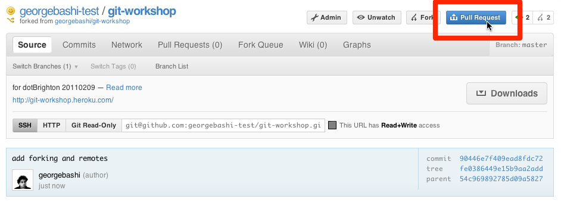

!SLIDE bullets
# Let's get started #
* Bookmark me: [http://cheat.errtheblog.com/s/git](http://cheat.errtheblog.com/s/git)
* Print me: [http://bit.ly/id98qP](http://bit.ly/id98qP)

!SLIDE commandline
# Introduce yourself to Git #
    $ git config --global user.name "George Bashi"
    $ git config --global user.email "jamil@georgebashi.com"
## Also (if you like) ##
    $ git config --global color.diff auto
    $ git config --global color.status auto
    $ git config --global color.branch auto

!SLIDE commandline
# Set your editor #
## Mac ##
    $ git config --global core.editor "mate -w"
## Linux ##
    $ git config --global core.editor "nano"
## Windows ##
### You're <del>stuck with</del> blessed with vim ###

!SLIDE center
# Fork me! #
## [https://github.com/georgebashi/git-workshop](https://github.com/georgebashi/git-workshop) ##

!SLIDE bullets smaller
# Grab a copy #
* `git clone https://github.com/yourname/git-workshop.git`
* 

!SLIDE commandline incremental

    $ git clone https://github.com/georgebashi/git-workshop.git
    Cloning into git-workshop...
    remote: Counting objects: 19, done.
    remote: Compressing objects: 100% (17/17), done.
    remote: Total 19 (delta 5), reused 0 (delta 0)
    Unpacking objects: 100% (19/19), done.
    
    $ cd git-workshop
    
    $ ls
    Gemfile      README.md    config.ru    get-started  what
    Gemfile.lock about-me     differences  showoff.json why

!SLIDE commandline incremental
# Create a feature branch #
    $ git checkout -b add-joke

!SLIDE commandline incremental
# Prepare a patch #
    $ git status
    # On branch add-joke
    # Changed but not updated:
    #   (use "git add <file>..." to update what will be committed)
    #   (use "git checkout -- <file>..." to discard changes in working directory)
    #
    #	modified:   programming-jokes/jokes.md
    #
    no changes added to commit (use "git add" and/or "git commit -a")

    $ git add programming-jokes/jokes.md
    
    $ git status
    # On branch add-joke
    # Changes to be committed:
    #   (use "git reset HEAD <file>..." to unstage)
    #
    #	modified:   programming-jokes/jokes.md
    #

!SLIDE commandline incremental
# Commit #
### Windows: press `i` to type, press `ESC :wq ENTER` to save and quit ###
    $ git commit
    [add-joke 54c9698] add a funny joke
     1 files changed, 1 insertions(+), 1 deletions(-)
    
    $ git log
    commit 54c969892785d09a58274b227fcbb470641d6810
    Author: George Bashi <jamil@georgebashi.com>
    Date:   Tue Feb 8 15:34:55 2011 +0000

        add a funny joke

    ...

    (press q to exit)

!SLIDE commandline incremental
# Push your changes to Github #
    $ git push origin master
    Counting objects: 7, done.
    Delta compression using up to 2 threads.
    Compressing objects: 100% (4/4), done.
    Writing objects: 100% (5/5), 628 bytes, done.
    Total 5 (delta 2), reused 0 (delta 0)
    To git@github.com:georgebashi/git-workshop.git
       a077d82..da418d1  master -> master

!SLIDE
# Send me a pull request #

## I'll accept :) ##
