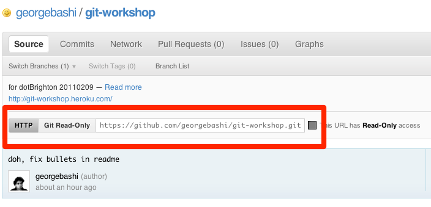
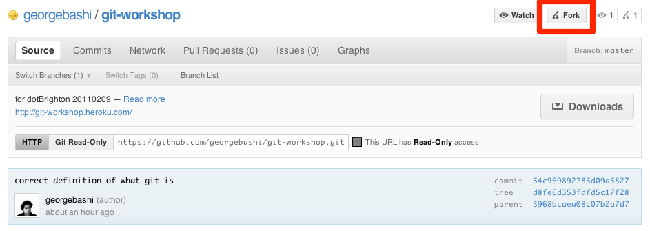
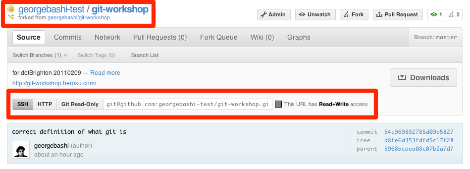

!SLIDE bullets incremental
# Let's get started #

* Bookmark me: [http://cheat.errtheblog.com/s/git](http://cheat.errtheblog.com/s/git)
* Print me: [http://bit.ly/id98qP](http://bit.ly/id98qP)

!SLIDE commandline
# Introduce yourself to Git #
    $ git config --global user.name "George Bashi"
    $ git config --global user.email "jamil@georgebashi.com"

## Also (if you like) ##
    $ git config --global color.diff auto
    $ git config --global color.status auto
    $ git config --global color.branch auto
!SLIDE bullets smaller
# Grab a repo to play with #
* `git clone https://github.com/georgebashi/git-workshop.git`
* 

!SLIDE commandline incremental

    $ git clone https://github.com/georgebashi/git-workshop.git
    Cloning into git-workshop...
    remote: Counting objects: 19, done.
    remote: Compressing objects: 100% (17/17), done.
    remote: Total 19 (delta 5), reused 0 (delta 0)
    Unpacking objects: 100% (19/19), done.
    
    $ cd git-workshop
    
    $ ls
    Gemfile      README.md    config.ru    get-started  what
    Gemfile.lock about-me     differences  showoff.json why
    
    $ gem install bundler --no-rdoc --no-ri
    Successfully installed bundler-1.0.10
    1 gem installed
    
    $ bundle install
    Using bluecloth (2.0.10)
    ...
    ...
    Your bundle is complete! ...
    
    # edit away!

!SLIDE commandline incremental
# Prepare a patch #
    $ git status
    # On branch master
    # Changed but not updated:
    #   (use "git add <file>..." to update what will be committed)
    #   (use "git checkout -- <file>..." to discard changes in working directory)
    #
    #	modified:   what/what.md
    #
    no changes added to commit (use "git add" and/or "git commit -a")

    $ git add what/what.md
    
    $ git status
    # On branch master
    # Changes to be committed:
    #   (use "git reset HEAD <file>..." to unstage)
    #
    #	modified:   what/what.md
    #

!SLIDE commandline incremental
# Commit #
    $ git commit
    [master 54c9698] correct definition of what git is
     1 files changed, 1 insertions(+), 1 deletions(-)
    
    $ git log
    commit 54c969892785d09a58274b227fcbb470641d6810
    Author: George Bashi <jamil@georgebashi.com>
    Date:   Tue Feb 8 15:34:55 2011 +0000

        correct definition of what git is

    commit 5968bcaea08c07b2a7d73e58734c5078fa0d21f1
    Author: George Bashi <jamil@georgebashi.com>
    Date:   Tue Feb 8 15:15:03 2011 +0000

        add the first blob of content

!SLIDE center
# Fork me! #

!SLIDE commandline
# Add the new remote #

    $ git remote add github git@github.com:georgebashi-test/git-workshop.git
    $ git push github master